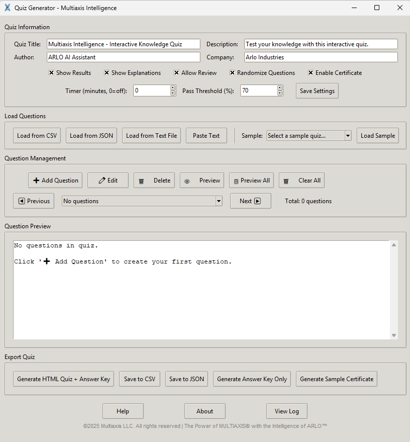

# Multiaxis Quiz Generator

A professional quiz generation system with a GUI interface for creating interactive HTML quizzes, developed as part of the **Multiaxis Intelligence Series**.


## Overview

Multiaxis Quiz Generator is a Python application that allows users to create, manage, and export interactive quizzes. It provides a user-friendly GUI interface, generates professional HTML quizzes, and now includes improved asset handling and build support.

### Application Screenshot



*(GUI preview showing the main application window — question entry, settings, and export options.)*

## Features

### Core Functionality
- **Multiple Import Formats**: Load questions from CSV, JSON, or formatted text files
- **Manual Question Entry**: Add and edit questions directly through the GUI
- **Interactive HTML Export**: Generate fully functional web-based quizzes
- **Answer Key Generation**: Automatic Markdown answer keys with explanations
- **Professional Certificates**: Generate certificates for successful quiz completion

### Quiz Features
- Multiple choice questions (up to 4 options)
- Explanations for each answer
- Image support for questions
- Difficulty levels (Easy, Medium, Hard)
- Timer functionality
- Pass/fail thresholds
- Question randomization
- Review mode

### Export Options
- Interactive HTML quiz files
- CSV format for spreadsheet editing
- JSON format for programmatic use
- Markdown answer keys
- Professional completion certificates

## Installation

### Prerequisites
- Python 3.8 or higher  
- tkinter (usually included with Python)  
- [PyInstaller](https://pyinstaller.org) (only if building executables)

### Setup
```bash
# Clone the repository
git clone https://github.com/yourusername/multiaxis-quiz-generator.git

# Navigate to the project directory
cd multiaxis-quiz-generator

# Run the application
python MultiaxisQuizGenerator.py
